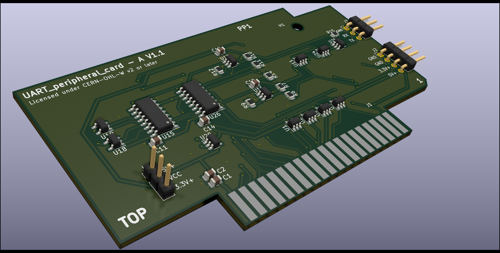
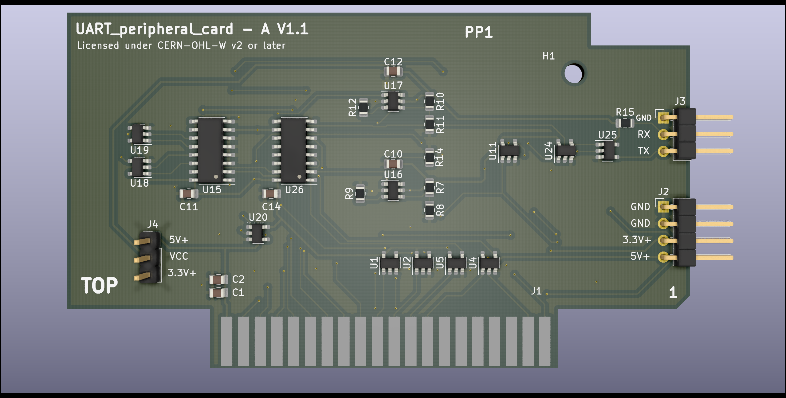
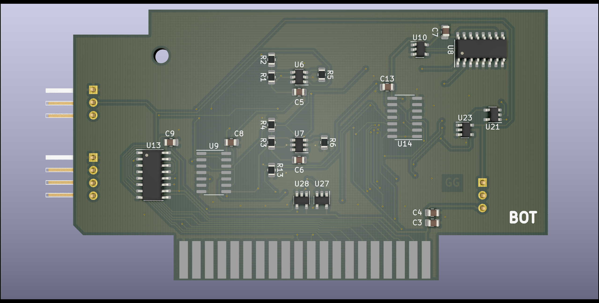

# UART_peripheral_card_A

Copyright (C) 2021 Guillaume Guillet\
Licensed under CERN-OHL-W v2 or later

<table border="0px">
<tr>
<td>
This source describes Open Hardware and is licensed under the CERN-OHL-W v2 or later.
</td>
</tr>
<tr>
<td>
You may redistribute and modify this documentation and make products
using it under the terms of the CERN-OHL-W v2 (https:/cern.ch/cern-ohl).
This documentation is distributed WITHOUT ANY EXPRESS OR IMPLIED
WARRANTY, INCLUDING OF MERCHANTABILITY, SATISFACTORY QUALITY
AND FITNESS FOR A PARTICULAR PURPOSE. Please see the CERN-OHL-W v2
for applicable conditions.
</td>
</tr>
</table>

Made with [Kicad](https://kicad-pcb.org/)

## Description
A UART peripheral card compatible with [PP1 standard](https://github.com/JonathSpirit/GComputer_standard).
This is a homemade without any microcontroller UART board that can transmit and receive in fixed 9600 baud rate and full-duplex.

 

## Stats

\
\
\

## Main features

- Follow the [PP1](https://github.com/JonathSpirit/GComputer_standard) standard.

- Fixed 9600 baud rate.

- Full duplex.

- 1 byte receive/transmit buffer.

- Compatible CMOS/TTL logic level.

## Documents
[Schematics (.pdf)](documents/UART_peripheral_card_A_schematics.pdf)

[Materials (.pdf)](documents/UART_peripheral_card_A_materials.pdf)

## Contributing / Questions
Please see [Contributing file](CONTRIBUTING.md)
